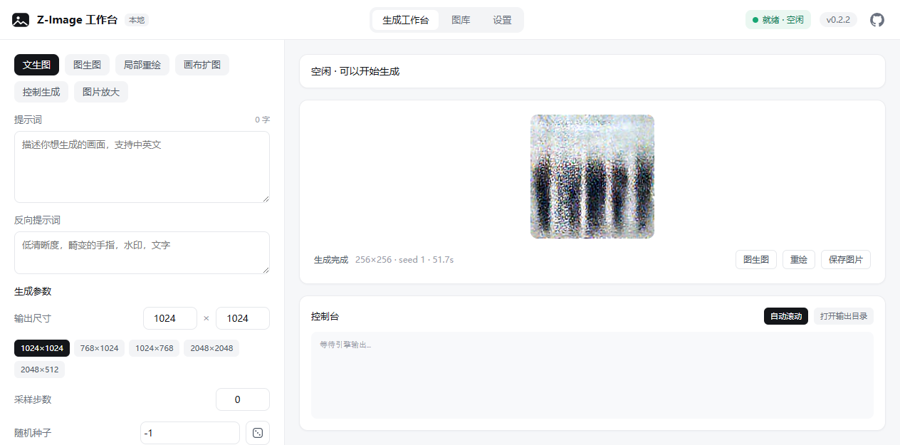
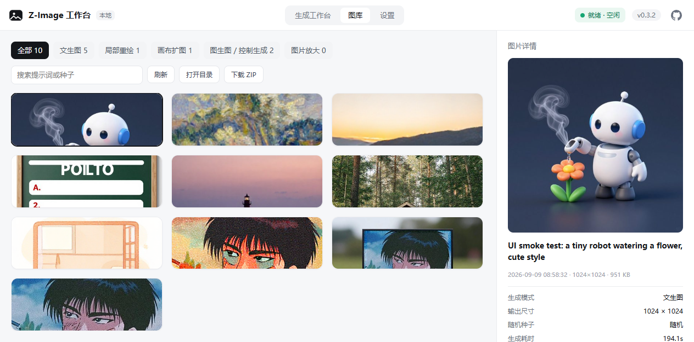
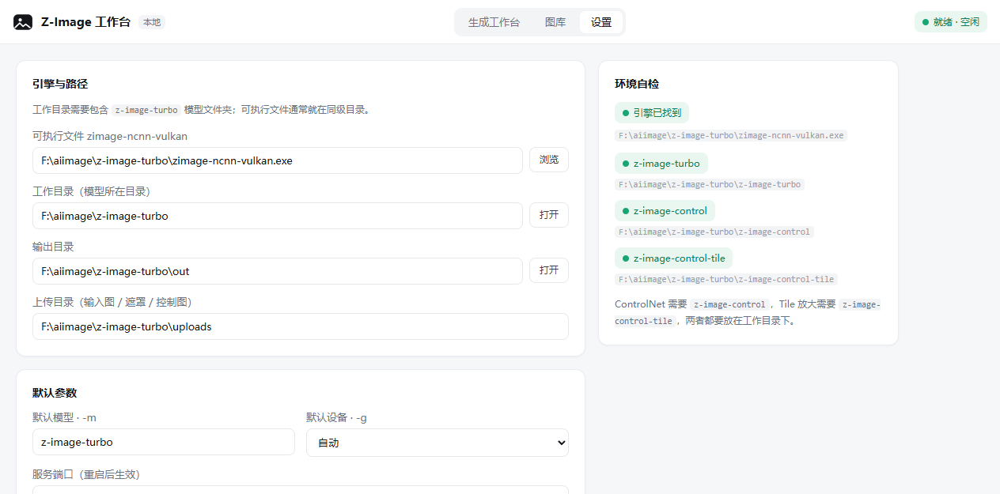

# Z-Image 工作台

基于 [zimage-ncnn-vulkan](https://github.com/nihui/zimage-ncnn-vulkan) 的本地生图管理与操作前端。
Go 后端 + Vue3 前端，整体白色调，编译为单个可执行文件，双击即用。

> 默认地址：`http://127.0.0.1:19777`（启动后自动打开浏览器） · 当前版本：`v0.1.0`

[](LICENSE)

## 界面预览

**生成工作台**



**图库**



**设置**



---

## 快速开始

### 环境要求

- Windows（理论支持 Linux/macOS，需自行编译）
- 显卡需支持 Vulkan；显存 + 一半内存 ≥ 16GB（受 WDDM 限制）
- zimage-ncnn-vulkan.exe 及模型文件已就位（本机已配置，无需额外操作）

### 启动

```
双击 zimage-webui.exe
```

启动后会自动探测引擎与模型位置并生成 `config.json`，然后打开浏览器访问工作台。

可选参数：

| 参数 | 说明 |
|---|---|
| `-port 19777` | 覆盖服务端口 |
| `-no-browser` | 启动后不自动打开浏览器 |

### 目录约定

引擎与模型放在同一目录（本机实际布局）：

```
F:\aiimage\z-image-turbo\
├── zimage-ncnn-vulkan.exe     # 推理引擎
├── z-image-turbo\             # 基础模型（必需）
├── z-image-control\           # ControlNet 模型（使用 ControlNet 时需要）
├── z-image-control-tile\      # Tile ControlNet 模型（使用 Tile 放大时需要）
├── out\                       # 生成图输出目录
└── uploads\                   # 输入图 / 蒙版 / 控制图上传目录
```

> 提示：`z-image-control` 与 `z-image-control-tile` 若存放在别处，可用目录联接链接过来：
> `New-Item -ItemType Junction -Path "F:\aiimage\z-image-turbo\z-image-control" -Target "实际模型目录"`

---

## 功能说明

### 生成工作台

支持五种模式，覆盖引擎全部命令行参数：

| 模式 | 对应参数 | 说明 |
|---|---|---|
| 文生图 | `-p -n -s -l -r -m -g -b` | 输入提示词直接生成 |
| 局部重绘 | `-i -k` | 上传原图 + 涂抹蒙版（白色=重绘，黑色=保留） |
| 画布扩图 | `-i -x` | 上传原图，按左/上/右/下像素向外扩展 |
| ControlNet | `-c -w` | 上传控制图（姿态/线稿/灰度等），可调控制强度 |
| Tile 放大 | `-c -t -s` | 低清图放大到目标分辨率（分块超分） |

通用能力：

- **实时进度**：解析引擎 `step n/N` 输出精确换算进度百分比，控制台同步滚动引擎日志
- **任务队列**：同一时间只跑一个任务（独占显卡），后续任务自动排队，可随时取消
- **批量生成**：`-b` 批量出多张，进度按张累计
- **快捷键**：`Ctrl + Enter` 提交生成
- **上传**：图片输入框支持点击选择与拖拽

### 图库

- 浏览输出目录全部生成图，按模式筛选、按提示词/种子搜索
- 点开查看完整参数（提示词、种子、步数、耗时、完整命令行）
- 一键复用参数 → 自动回填到生成工作台
- 全屏预览（`Esc` 关闭）、下载原图、在资源管理器中打开目录、删除

### 设置

- 引擎路径、工作目录、输出目录、上传目录可视化配置
- 环境自检：一键确认 exe 与三个模型目录是否就位
- 默认模型、GPU 设备（自动 / CPU / 指定设备）、服务端口（改动后重启生效）

---

## 配置文件

`config.json` 与 exe 同级，首次启动自动生成：

```json
{
  "exePath": "F:\\aiimage\\z-image-turbo\\zimage-ncnn-vulkan.exe",
  "workDir": "F:\\aiimage\\z-image-turbo",
  "outputDir": "F:\\aiimage\\z-image-turbo\\out",
  "uploadDir": "F:\\aiimage\\z-image-turbo\\uploads",
  "modelPath": "z-image-turbo",
  "gpuId": -2,
  "port": 19777
}
```

| 字段 | 说明 |
|---|---|
| `exePath` | zimage-ncnn-vulkan 可执行文件路径 |
| `workDir` | 工作目录，模型文件夹所在位置（`-m` 相对此目录解析） |
| `outputDir` | 生成图输出目录 |
| `uploadDir` | 重绘/扩图/ControlNet 输入图上传目录 |
| `modelPath` | 默认 `-m` 参数 |
| `gpuId` | 默认 `-g` 参数：`-2` 自动、`-1` CPU、`≥0` 指定设备 |
| `port` | 服务端口，改动后重启生效 |

> exe 被移动导致路径失效时，服务会自动向上逐级重新探测。

---

## 从源码构建

依赖：Go 1.22+、Node.js 18+。支持 Windows / Linux / macOS。

```
cd webui
build.bat        # Windows 一键构建
./build.sh       # Linux / macOS 一键构建
./build.sh all   # 交叉编译 Windows / Linux / macOS 全平台产物（输出到 dist/）
```

手动构建：

```
cd web
npm install
npm run build    # 产物输出到 web/dist
cd ..
go build -o zimage-webui.exe .     # Linux/macOS 用 go build -o zimage-webui .
```

后端为纯 Go 标准库实现，无 CGO 依赖，可直接交叉编译：

```
GOOS=windows GOARCH=amd64 go build -o dist/zimage-webui-windows-amd64.exe .
GOOS=linux   GOARCH=amd64 go build -o dist/zimage-webui-linux-amd64 .
GOOS=darwin  GOARCH=arm64 go build -o dist/zimage-webui-darwin-arm64 .
```

> 平台差异说明：开机自启目前仅 Windows 实现（注册表 Run 项），其他平台设置页会提示不支持；
> 「打开输出目录」与自动打开浏览器在三大平台均已适配。

前端已做窄窗口响应式适配（≤920px 自动切换上下布局），平板与分屏场景可用。

前端通过 `go:embed` 打进二进制；运行时若 exe 同级存在 `web/dist` 目录则优先读磁盘（便于开发热更），否则使用内嵌资源。

### 开发调试

```
cd web
npm run dev      # Vite 开发服务器 5173 端口，已配置代理到 127.0.0.1:19777
```

### 项目结构

```
webui/
├── main.go                  # 入口：配置加载、路由、自动开浏览器
├── server/
│   ├── api.go               # REST API 与 SSE、静态资源服务
│   ├── job.go               # 任务队列、进程管理、进度解析
│   ├── config.go            # 配置读写与环境自检
│   ├── gallery.go           # 图库扫描与参数元数据
│   └── icon.go              # 应用图标生成
├── web/
│   ├── src/
│   │   ├── views/           # 生成工作台 / 图库 / 设置
│   │   ├── components/      # 参数面板 / 预览 / 控制台 / 灯箱
│   │   └── store.js         # 全局状态与 SSE 订阅
│   └── vite.config.js
├── config.json              # 运行配置（自动生成）
└── build.bat                # 一键构建
```

---

## HTTP API

| 方法 | 路径 | 说明 |
|---|---|---|
| GET | `/api/system` | 环境自检（exe 与模型状态） |
| GET / POST | `/api/config` | 读取 / 保存配置 |
| POST | `/api/generate` | 提交生成任务 |
| GET | `/api/jobs` | 任务列表 |
| GET / DELETE | `/api/jobs/{id}` | 查询 / 删除任务 |
| POST | `/api/jobs/{id}/cancel` | 取消任务 |
| GET | `/api/events` | SSE 实时事件（任务状态 + 日志） |
| POST | `/api/upload` | 上传图片 |
| GET | `/api/gallery` | 图库列表 |
| GET / DELETE | `/api/gallery/{name}` | 图片详情 / 删除 |
| POST | `/api/open` | 在资源管理器中打开目录 |
| GET | `/media/{name}` | 输出图片 |
| GET | `/uploads/{name}` | 上传图片 |

---

## 常见问题

**生成失败 / 崩溃？**
先升级显卡驱动：[Intel](https://downloadcenter.intel.com/product/80939/Graphics-Drivers) / [AMD](https://www.amd.com/en/support) / [NVIDIA](https://www.nvidia.com/Download/index.aspx)。首次生成需加载模型，耗时较长属正常（后续任务会快很多）。

**ControlNet / Tile 放大按钮提示模型缺失？**
需要 `z-image-control` / `z-image-control-tile` 模型文件夹位于工作目录下（见「目录约定」的联接方法）。

**Windows 显存不够？**
WDDM 限制 Vulkan 应用只能用一半系统内存，需满足「一半内存 + 显存 ≥ 16GB」。可在设置中把设备切到 `-1`（CPU）兜底，但速度会很慢。

**端口被占用？**
`zimage-webui.exe -port 其他端口` 启动，或修改 `config.json` 的 `port` 后重启。

---

## 相关项目

- 推理引擎：[zimage-ncnn-vulkan](https://github.com/nihui/zimage-ncnn-vulkan)
- Z-Image 模型：[Tongyi-MAI/Z-Image](https://github.com/Tongyi-MAI/Z-Image)
- 模型下载：[nihui-szyl/z-image-ncnn](https://huggingface.co/nihui-szyl/z-image-ncnn/tree/main)
- 重绘管线参考：[scraed/LanPaint](https://github.com/scraed/LanPaint)

## 开源协议

本项目基于 [MIT License](LICENSE) 开源。

版本号定义在后端 `server/config.go` 的 `AppVersion` 常量中，页面右上角与设置接口 `/api/system` 同步展示；发版时更新该常量并重新构建即可。
